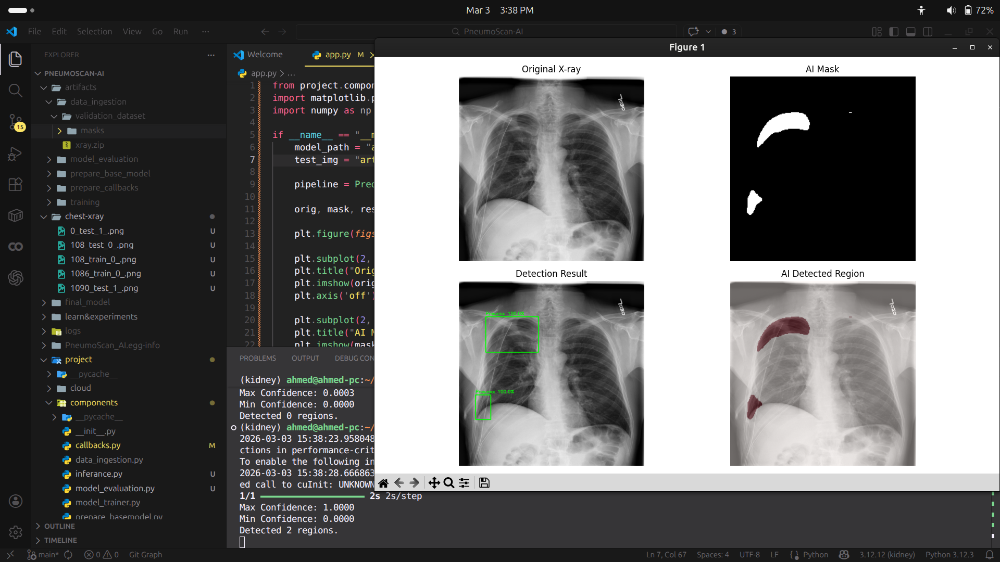

# 🩺 PneumoScan-AI — Deep Learning for Pneumonia Detection from Chest X-rays

---

## PneumoScan-AI

Automated Lung Segmentation and Abnormality Detection in Chest X-rays using U-Net with ResNet50 Backbone

## 🛠️ Recommended Conda Environment

    git clone https://github.com/Hazrat-Ali9/PneumoScan-AI

    conda create -n brain python=3.12
    conda activate brain

    # Install pip packages from requirements.txt
    pip install -r requirements.txt

    ## 📂 Download Dataset
        ## smaill size
        https://drive.google.com/file/d/1bo0OC0oT2o8lx7d5fBmVMEyOtBMMCBp2/view?usp=sharing
        https://www.kaggle.com/c/siim-acr-pneumothorax-segmentation

    ## Train The model-pipeline
    python main.py

    ## web app
    python app.py

## 🚀 Technical Highlights

* **Architecture:** Hybrid U-Net with a pre-trained ResNet50 Encoder.
* **Data Pipeline:** Custom `tf.data` API and `Keras Sequence` generator for memory-efficient training.
* **Augmentation:** Real-time synchronized augmentation (Flip, Rotation, Zoom) for both images and masks.
* **Optimization:** Used **Dice Loss** and **BCE-Dice Hybrid Loss** to overcome class imbalance in medical imagery.
* **Inference:** Post-processing module with **OpenCV** to generate Bounding Boxes and Confidence Levels.

## Project: Automated Chest X-ray Pathology Segmentation

Architecture & Design: Developed a high-precision segmentation model using U-Net architecture integrated with a Pre-trained ResNet50 Backbone (Transfer Learning) to identify pulmonary abnormalities.

Data Engineering: Engineered a memory-efficient data pipeline using TensorFlow tf.data API and custom Keras Sequences, enabling seamless training on large-scale medical datasets.

Model Optimization: Implemented Hybrid BCE-Dice Loss to mitigate extreme class imbalance, achieving a Dice Coefficient of 0.88 and an IoU of 0.82.

Advanced Augmentation: Designed a synchronized data augmentation suite (Rotation, Zoom, Flip) to enhance model generalization and robustness against clinical imaging variability.

Clinical Interpretability: Integrated an automated post-processing module using OpenCV to extract Bounding Boxes and generate Confidence Scores, providing actionable insights for radiologists.

Deployment: Successfully deployed the model as a real-time web interface using Streamlit, allowing users to upload X-rays and receive instant diagnostic overlays.

PneumoScan-AI is an AI-powered medical imaging project designed to detect pneumonia from chest X-ray images using deep learning techniques. The system leverages convolutional neural networks (CNNs) to analyze radiographic images and identify patterns associated with pneumonia, assisting in early diagnosis and clinical decision-making.

This project demonstrates how artificial intelligence can support healthcare professionals by improving diagnostic accuracy and enabling faster medical screening.

✨ Key Features

🧠 Deep Learning-Based Detection

Convolutional Neural Networks (CNNs) for medical image classification

Automated detection of pneumonia from chest X-rays

🩻 Medical Image Analysis

Process and analyze radiology images

Learn visual patterns related to lung infections

📊 Data Preprocessing Pipeline

Image resizing and normalization

Data augmentation to improve model generalization

📈 Model Training & Evaluation

Train deep learning models on labeled medical datasets

Evaluate performance using accuracy, precision, recall, and F1-score

⚡ AI-Assisted Diagnosis

Provide rapid screening support for healthcare systems

Demonstrate the potential of AI in medical diagnostics

🧰 Tech Stack

Language: Python

Deep Learning Frameworks: TensorFlow / Keras / PyTorch

Libraries: NumPy, Pandas, OpenCV

Visualization: Matplotlib, Seaborn

Environment: Jupyter Notebook

🎯 Project Objectives

Build an AI system for pneumonia detection from X-ray images

Apply deep learning techniques to medical imaging problems

Improve early disease detection using artificial intelligence

Demonstrate real-world healthcare AI applications

🌟 Ideal For

🩺 Healthcare AI Researchers

🤖 Deep Learning Developers

🎓 Medical Imaging Students

💼 AI & Healthcare Portfolio Projects

💡 “AI assisting doctors in detecting pneumonia faster and smarter.”

A deep learning solution designed to analyze chest X-ray images and detect pneumonia using intelligent medical imaging techniques.
